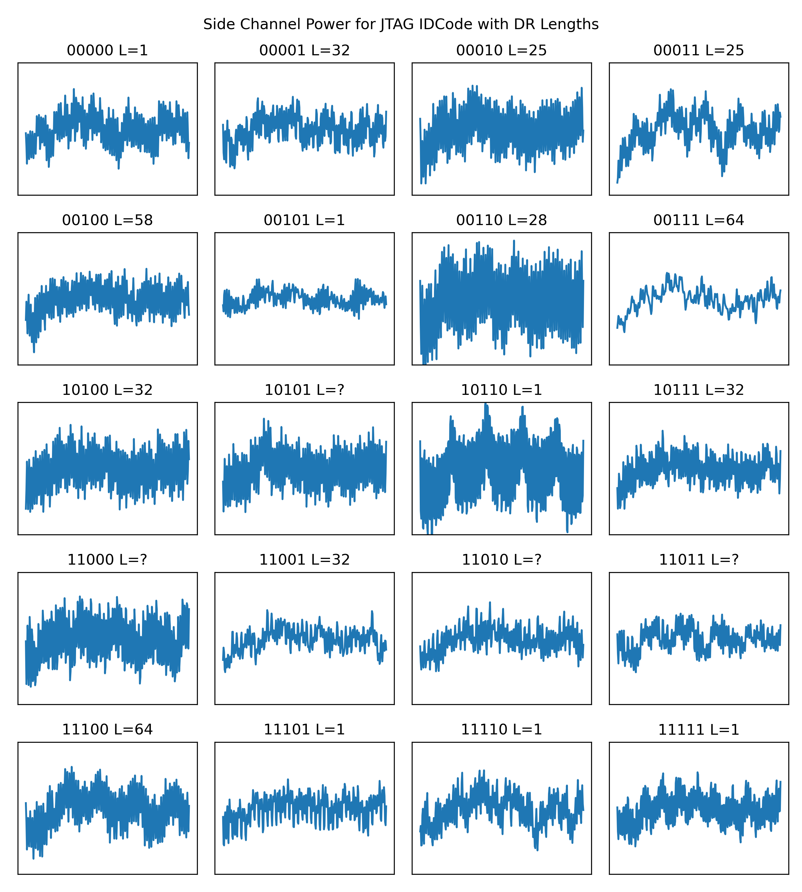

# May 2024 - Issue 406: Experiments with JTAG (Final title TBD)

This article looks at using [PyJtagBS](https://github.com/colinoflynn/pyjtagbs) with ChipWhisperer-Husky to do lots of interesting JTAG work.
This looks at the MPC5676R device which I used in my [BAM BAM!!](https://colinoflynn.com/2020/11/bam-bam-on-reliability-of-emfi-for-in-situ-automotive-ecu-attacks/) work.

Check out the [Example Notebook](JTAG%20Experiments%20Notebook.ipynb) which has all the fun!

It starts with some classic JTAG - using the MPC5676R (Quovvora) NEXUS & OnCE interfaces via Python, before going into fuzzing & power analysis examples.

For example you can see the default values of some JTAG registers along with some "unknown" instructions. Here is a dumping of all instructions & the associated detected data register length on the MPC5676R:

```
lengths = []
for i in range(0, 32):
    interface._jtag_reset()
    interface.read_DR(0, pause_dr=True)
    interface.write_IR(i, 5)
    length, default = interface.measure_DR_length(max=257)
    print("{0:05b}: {1:d} ({2:})".format(i, length, str(default)))   
    lengths.append(length)

00000: 1 ([0, 0, 0, 0, 0, 0, 0, 0, 0, 0, 0, 0, 0, 0, 0, 0, 0, 0, 0, 0, 0, 0, 0, 0, 0, 0, 0, 0, 0, 0, 0, 0, 0])
00001: 32 ([29, 96, 39, 8, 0, 0, 0, 0, 0, 0, 0, 0, 0, 0, 0, 0, 0, 0, 0, 0, 0, 0, 0, 0, 0, 0, 0, 0, 0, 0, 0, 0, 0])
00010: 25 ([0, 0, 128, 0, 0, 0, 0, 0, 186, 2, 136, 0, 0, 0, 0, 192, 225, 8, 4, 0, 0, 132, 162, 102, 170, 170, 154, 10, 0, 0, 0, 1, 0])
00011: 25 ([0, 0, 128, 0, 0, 0, 0, 0, 186, 2, 136, 0, 0, 0, 0, 192, 225, 8, 4, 0, 0, 132, 162, 102, 170, 170, 154, 10, 0, 0, 0, 3, 0])
00100: 46 ([192, 0, 128, 64, 0, 0, 0, 0, 181, 0, 17, 0, 0, 0, 0, 8, 35, 0, 0, 0, 0, 163, 34, 170, 214, 82, 1, 0, 4, 0, 0, 0, 0])
00101: 1 ([0, 0, 0, 0, 0, 0, 0, 0, 0, 0, 0, 0, 0, 0, 0, 0, 0, 0, 0, 0, 0, 0, 0, 0, 0, 0, 0, 0, 0, 0, 0, 0, 0])
00110: 28 ([27, 0, 0, 0, 0, 0, 0, 0, 0, 0, 0, 0, 0, 0, 0, 0, 0, 0, 0, 0, 0, 0, 0, 0, 0, 0, 0, 0, 0, 0, 0, 0, 0])
00111: 64 ([0, 0, 0, 0, 0, 0, 0, 0, 0, 0, 0, 0, 0, 0, 0, 0, 0, 0, 0, 0, 0, 0, 0, 0, 0, 0, 0, 0, 0, 0, 0, 0, 0])
01000: 1 ([0, 0, 0, 0, 0, 0, 0, 0, 0, 0, 0, 0, 0, 0, 0, 0, 0, 0, 0, 0, 0, 0, 0, 0, 0, 0, 0, 0, 0, 0, 0, 0, 0])
01001: 1 ([0, 0, 0, 0, 0, 0, 0, 0, 0, 0, 0, 0, 0, 0, 0, 0, 0, 0, 0, 0, 0, 0, 0, 0, 0, 0, 0, 0, 0, 0, 0, 0, 0])
01010: -1 ([0, 0, 0, 0, 0, 0, 0, 0, 0, 0, 0, 0, 0, 0, 0, 0, 0, 0, 0, 0, 0, 0, 0, 0, 0, 0, 0, 0, 0, 0, 0, 0, 0])
01011: 1 ([0, 0, 0, 0, 0, 0, 0, 0, 0, 0, 0, 0, 0, 0, 0, 0, 0, 0, 0, 0, 0, 0, 0, 0, 0, 0, 0, 0, 0, 0, 0, 0, 0])
01100: 1 ([0, 0, 0, 0, 0, 0, 0, 0, 0, 0, 0, 0, 0, 0, 0, 0, 0, 0, 0, 0, 0, 0, 0, 0, 0, 0, 0, 0, 0, 0, 0, 0, 0])
01101: 1 ([0, 0, 0, 0, 0, 0, 0, 0, 0, 0, 0, 0, 0, 0, 0, 0, 0, 0, 0, 0, 0, 0, 0, 0, 0, 0, 0, 0, 0, 0, 0, 0, 0])
01110: 1 ([0, 0, 0, 0, 0, 0, 0, 0, 0, 0, 0, 0, 0, 0, 0, 0, 0, 0, 0, 0, 0, 0, 0, 0, 0, 0, 0, 0, 0, 0, 0, 0, 0])
01111: 1 ([0, 0, 0, 0, 0, 0, 0, 0, 0, 0, 0, 0, 0, 0, 0, 0, 0, 0, 0, 0, 0, 0, 0, 0, 0, 0, 0, 0, 0, 0, 0, 0, 0])
10000: 32 ([29, 96, 39, 8, 0, 0, 0, 0, 0, 0, 0, 0, 0, 0, 0, 0, 0, 0, 0, 0, 0, 0, 0, 0, 0, 0, 0, 0, 0, 0, 0, 0, 0])
10001: 32 ([29, 128, 194, 7, 0, 0, 0, 0, 0, 0, 0, 0, 0, 0, 0, 0, 0, 0, 0, 0, 0, 0, 0, 0, 0, 0, 0, 0, 0, 0, 0, 0, 0])
10010: 1 ([0, 0, 0, 0, 0, 0, 0, 0, 0, 0, 0, 0, 0, 0, 0, 0, 0, 0, 0, 0, 0, 0, 0, 0, 0, 0, 0, 0, 0, 0, 0, 0, 0])
10011: 32 ([29, 0, 198, 7, 0, 0, 0, 0, 0, 0, 0, 0, 0, 0, 0, 0, 0, 0, 0, 0, 0, 0, 0, 0, 0, 0, 0, 0, 0, 0, 0, 0, 0])
10100: 32 ([29, 0, 198, 7, 0, 0, 0, 0, 0, 0, 0, 0, 0, 0, 0, 0, 0, 0, 0, 0, 0, 0, 0, 0, 0, 0, 0, 0, 0, 0, 0, 0, 0])
10101: -1 ([0, 0, 0, 0, 0, 0, 0, 0, 0, 0, 0, 0, 0, 0, 0, 0, 0, 0, 0, 0, 0, 0, 0, 0, 0, 0, 0, 0, 0, 0, 0, 0, 0])
10110: 1 ([0, 0, 0, 0, 0, 0, 0, 0, 0, 0, 0, 0, 0, 0, 0, 0, 0, 0, 0, 0, 0, 0, 0, 0, 0, 0, 0, 0, 0, 0, 0, 0, 0])
10111: 32 ([29, 0, 198, 7, 0, 0, 0, 0, 0, 0, 0, 0, 0, 0, 0, 0, 0, 0, 0, 0, 0, 0, 0, 0, 0, 0, 0, 0, 0, 0, 0, 0, 0])
11000: -1 ([0, 0, 0, 0, 0, 0, 0, 0, 0, 0, 0, 0, 0, 0, 0, 0, 0, 0, 0, 0, 0, 0, 0, 0, 0, 0, 0, 0, 0, 0, 0, 0, 0])
11001: 32 ([29, 128, 194, 7, 0, 0, 0, 0, 0, 0, 0, 0, 0, 0, 0, 0, 0, 0, 0, 0, 0, 0, 0, 0, 0, 0, 0, 0, 0, 0, 0, 0, 0])
11010: -1 ([0, 0, 0, 0, 0, 0, 0, 0, 0, 0, 0, 0, 0, 0, 0, 0, 0, 0, 0, 0, 0, 0, 0, 0, 0, 0, 0, 0, 0, 0, 0, 0, 0])
11011: -1 ([0, 0, 0, 0, 0, 0, 0, 0, 0, 0, 0, 0, 0, 0, 0, 0, 0, 0, 0, 0, 0, 0, 0, 0, 0, 0, 0, 0, 0, 0, 0, 0, 0])
11100: 64 ([29, 128, 194, 7, 29, 128, 194, 7, 0, 0, 0, 0, 0, 0, 0, 0, 0, 0, 0, 0, 0, 0, 0, 0, 0, 0, 0, 0, 0, 0, 0, 0, 0])
11101: 1 ([0, 0, 0, 0, 0, 0, 0, 0, 0, 0, 0, 0, 0, 0, 0, 0, 0, 0, 0, 0, 0, 0, 0, 0, 0, 0, 0, 0, 0, 0, 0, 0, 0])
11110: 1 ([0, 0, 0, 0, 0, 0, 0, 0, 0, 0, 0, 0, 0, 0, 0, 0, 0, 0, 0, 0, 0, 0, 0, 0, 0, 0, 0, 0, 0, 0, 0, 0, 0])
11111: 1 ([0, 0, 0, 0, 0, 0, 0, 0, 0, 0, 0, 0, 0, 0, 0, 0, 0, 0, 0, 0, 0, 0, 0, 0, 0, 0, 0, 0, 0, 0, 0, 0, 0])
```

Compare that to the "valid"/"known" codes:

| Instruction        | Code[4:0] | Instruction Summary                                                               |
|--------------------|-----------|-----------------------------------------------------------------------------------|
| IDCODE             | 00001     | Selects device identification register for shift                                   |
| SAMPLE/PRELOAD     | 00010     | Selects boundary scan register for shifting, sampling, and preloading without disturbing functional operation |
| SAMPLE             | 00011     | Selects boundary scan register for shifting and sampling without disturbing functional operation             |
| EXTEST             | 00100     | Selects boundary scan register while applying preloaded values to output pins and asserting functional reset  |
| ENABLE_CENSOR_CTRL | 00111     | Selects CENSOR_CTRL register                                                      |
| HIGHZ              | 01001     | Selects bypass register while three-stating all output pins and asserting functional reset                   |
| CLAMP              | 01100     | Selects bypass register while applying preloaded values to output pins and asserting functional reset        |
| ACCESS_AUX_TAP_NPC | 10000     | Enables access to the NPC TAP controller                                         |
| ACCESS_AUX_TAP_OnCE| 10001     | Enables access to the primary e200 OnCE TAP controller (Primary CPU, core 0)      |
| ACCESS_AUX_TAP_eTPU| 10010     | Enables access to the eTPU Nexus TAP controller (eTPU_A, eTPU_B, CDC_AB)          |
| ACCESS_AUX_TAP_NXDM| 10011     | Enables access to the eDMA_A Nexus TAP controller (for Data Trace)                 |
| ACCESS_AUX_TAP_NXFR| 10100     | Enables access to the FlexRay Nexus TAP controller (for Data Trace)               |
| ACCESS_AUX_TAP_eTPU_SECONDARY | 10110 | Enables access to a secondary set of eTPU modules (eTPU_C, eTPU_D, CDC_CD) |
| ACCESS_AUX_TAP_NXDM_B      | 10111     | Enables access to the eDMA_B Nexus TAP controller (for Data Trace)  |
| ACCESS_AUX_TAP_OnCE1       | 11001     | Enables access to the secondary OnCE TAP controller (core 1)        |
| ACCESS_AUX_TAP_MULTI       | 11100     | Serialize the JTAG Instruction all internal cores                   |
| BYPASS                     | 11111     | Selects bypass register for data operations                         |
| Factory Debug Reserved¹    | 00101     | Intended for factory debug only                                     |
|                           | 00110     |                                                                     |
|                           | 01010     |                                                                     |
| Reserved²                  | All Other Codes | Decoded to select bypass register                                  |

The example then runs power analysis to understand if some of those codes seem to be doing anything interesting:



You can run this yourself from the repo, or even load the recorded power traces & zoom in on the instruction examples.
